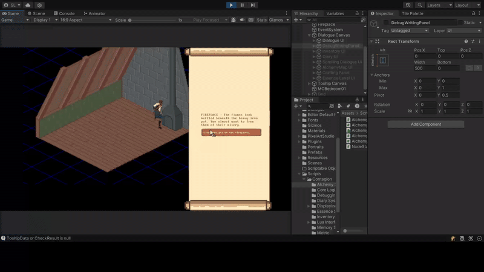

# Branching Narrative System

## Inspiration & Motivation
Inspired by Disco Elysium's narrative depth and dialogue mechanics, this project allows writers to write non-linear, branching stories for games. 

## Technical Approach

I integrated **Articy Draft** with Unity using **Pixel Crushers Dialogue System** as the bridge. Dialogue content is authored in Articy and exported as `.asset` files that Unity imports automatically.

### Articy Integration

The integration uses a custom field mapping system that translates Articy's field-based data into Unity's type-safe enums and data structures. Instead of storing complex data directly in Articy fields, the system uses numeric IDs that map to predefined arrays (e.g., difficulty levels, ingredients, modifiers).

Game state is synchronized through **Lua scripting** - Articy conditions use Lua expressions to check variables (like `Variable["quest_completed"]` or `inventory["copper_wire"]`), and custom C# functions are registered with Lua to allow Articy scripts to call Unity code (e.g., `GainItem()`, `RemoveItem()`).

The system also automatically imports quest data from Articy conversations marked with specific fields, converting them into the game's diary system with subtasks, conditions, and rewards.

### Branching Dialogue System

The dialogue system supports dynamic, state-aware conversations with conditional responses. Branching is handled through dialogue entry links in the conversation graph - when multiple outgoing links represent player response options, the system shows response buttons; otherwise, it displays a continue button for linear dialogue.

Responses are dynamically filtered and formatted based on game state using Lua condition evaluation. The system includes specialized **crafting check nodes** for skill-based actions that:

- Display pre-check tooltips showing difficulty, required ingredients, and applicable modifiers
- Calculate results dynamically based on player inventory, modifiers, and random rolls
- Branch dialogue differently based on four possible outcomes (Critical Success, Success, Partial Success, Failure)

The UI features auto-scrolling dialogue logs and smooth state transitions between continue buttons and response options.

## Demo

*Isometric scene with live scrolling dialogue (UI and visuals are in early/prototype stage).*  

## Limitations & Future Work
- UI and visuals use placeholders; goal was rapid iteration
